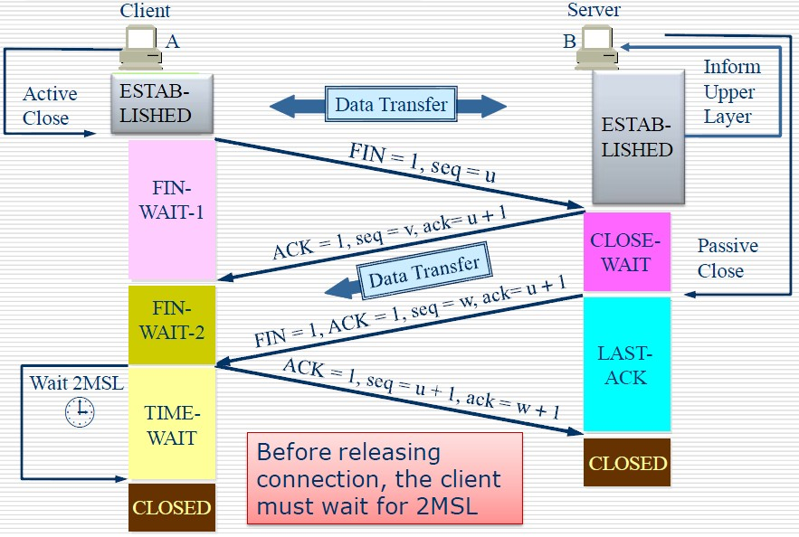
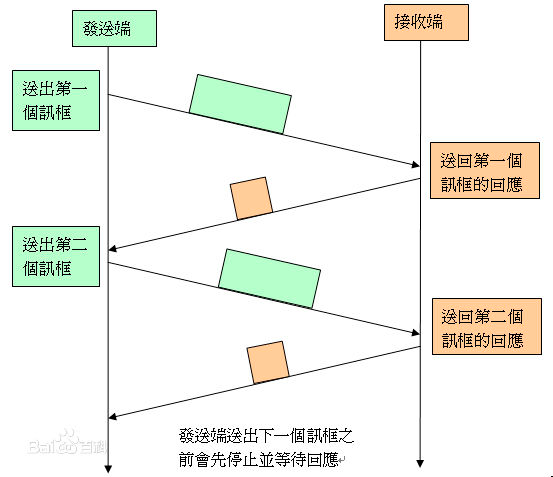
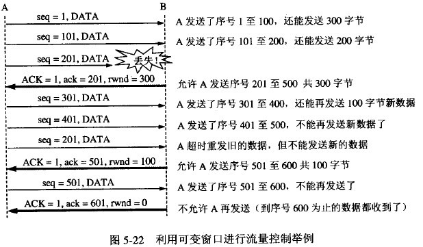

# TCP

## TCP概述

### TCP的特点

  - TCP是面向连接的传输层协议。
  - TCP连接是点对点的（套接字--IP:Port到套接字）。
  - TCP提供可靠交付的服务。
  - TCP提供全双工通信。
  - 面向字节流。

### TCP与UDP的区别。

  ||TCP |UDP |
  |---|-----|-----|
  | 是否连接 | 面向连接 |面向非连接 |
  | 传输可靠性 | 可靠 | 不可靠 |
  | 应用场合 | 传输大量数据 | 少量数据 |
  | 速度| 慢 | 快 |

### 基本概念：

  - `发送缓存和接受缓存`：用来临时保存双向通信的数据。在发送时，应用程序将数据传送给TCP发送缓存后，就可以做自己的事情，TCP在合适的时候发送数据；在接受数据时，TCP把发送的数据放入缓存，上层应用在合适的时候读取缓存即可。

  - `滑动窗口`：TCP的滑动窗口以字节为单位，用3个指针进行表示。当窗口内连续报文段被确认收到后，可以将窗口向前滑动。窗口大小应小于等于缓存区的大小。

  - `滑动窗口协议`：只有在接收窗口向前滑动时（与此同时也发送了确认），发送窗口才有可能向前滑动。收发两端的窗口按照以上规律不断地向前滑动，因此这种协议又称为滑动窗口协议。

  > 当发送窗口和接收窗口的大小都等于 1时，就是停止等待协议。

  > 当发送窗口大于1，接收窗口等于1时，就是回退N步协议。

  > 当发送窗口和接收窗口的大小均大于1时，就是选择重发协议。

## TCP报文结构。


- 源端口、目的端口：16位长。标识出远端和本地的端口号。
- 序列号：32位长。表明了发送的数据报的顺序，不一定从0开始。
- 确认号：32位长。希望收到的下一个数据报的序列号，表明到序列号`N-1`为止的所有数据已经正确收到。
- TCP协议数据报头长：4位长。表明TCP头中包含多少个32位字。
- 接下来的6位未用。
- ACK：**ACK位置1表明确认号是合法的**。如果ACK为0，那么数据报不包含确认信息，确认字段被省略。
- PSH：表示是带有PUSH标志的数据。接收方因此请求数据报一到便可送往应用程序而不必等到缓冲区装满时才传送。
- RST：用于复位由于主机崩溃或其它原因而出现的错误的连接。还可以用于拒绝非法的数据报或拒绝连接请求。
- SYN：用于建立连接。
- FIN：用于释放连接。
- 窗口大小：16位长。窗口大小字段表示在确认了字节之后还可以发送多少个字节。
- 校验和：16位长。是为了确保高可靠性而设置的。它校验头部、数据和伪TCP头部之和。
- 紧急指针：`URG=1`时才有意义。
- 可选项：长度可变，最长40个字节。
  - MMS
  - SACK：选择确认。
  - 时间戳：计算往返时间；用于处理TCP序号超过`2^32`的情况，又称为防止序号回绕（PAWS）。

> TCP最小长度为20个字节。

## 三次握手

  - 第一次握手：建立连接时，客户端发送syn包（syn=j）到服务器，并进入`SYN_SENT`状态，等待服务器确认；*SYN：同步序列编号（Synchronize Sequence Numbers）*。
  - 第二次握手：服务器收到syn包，必须确认客户的SYN（ack=j+1），同时自己也发送一个SYN包（syn=k），即SYN+ACK包，此时服务器进入`SYN_RECV`状态；
  - 第三次握手：客户端收到服务器的SYN+ACK包，向服务器发送确认包ACK(ack=k+1），此包发送完毕，客户端和服务器进入`ESTABLISHED`（TCP连接成功）状态，完成三次握手。

### 内核对 TCP 的处理

Socket 是一个由 源IP、源Port、目标IP、目标Port、协议 组成的五元组，唯一标示一个 socket 连接。

TCP 建立连接的整体流程：

  1. 服务器端在调用 `listen` 之后，内核会建立两个队列，`SYN`队列和`ACCEPT`队列，其中`ACCPET`队列的长度由`backlog`指定。
  2. 服务器端在调用 `accpet` 之后，将阻塞，等待 `ACCPT` 队列有元素。
  3. 客户端在调用 `connect` 之后，将开始发起 `SYN` 请求，请求与服务器建立连接，此时称为第一次握手。
  4. 服务器端在接受到 `SYN` 请求之后，把请求方放入 `SYN` 队列中，并给客户端回复一个确认帧 `ACK` ，此帧还会携带一个请求与客户端建立连接的请求标志，也就是 `SYN` ，这称为第二次握手
  5. 客户端收到 `SYN+ACK` 帧后， `connect` 返回，并发送确认建立连接帧 `ACK` 给服务器端。这称为第三次握手
  6. 服务器端收到 `ACK` 帧后，会把请求方从 `SYN` 队列中移出，放至 `ACCEPT` 队列中，而 `accept` 函数也等到了自己的资源，从阻塞中唤醒，从 `ACCEPT` 队列中取出请求方，重新建立一个新的 `sockfd` ，并返回。

在服务端如何分发多个连接的请求？

由于 `TCP/IP` 协议栈是维护着一个接收和发送缓冲区的。在接收到来自客户端的数据包后，服务器端的 `TCP/IP` 协议栈应该会做如下处理：

  1. 如果收到的是请求连接的数据包，则传给监听着连接请求端口的 `socetfd` 套接字。
  2. 如果是已经建立过连接后的客户端数据包，则将数据放入接收缓冲区。这样，当服务器端需要读取指定客户端的数据时，则可以利用 `socketfd_new` 套接字通过 `recv` 或者 `read` 函数到缓冲区里面去取指定的数据（因为 `socketfd_new` 代表的 `socket` 对象记录了客户端IP和端口，因此可以鉴别）。

数据包如何找到相对应的 socket ，这个方法在 Linux Kernel 代码里也是有体现的：

```
static inline struct sock *__inet_lookup(struct net *net,
                     struct inet_hashinfo *hashinfo,
                     const __be32 saddr, const __be16 sport,
                     const __be32 daddr, const __be16 dport,
                     const int dif)
{
    u16 hnum = ntohs(dport);
    /* 先尝试查找处于连接成功的 socket */
    struct sock *sk = __inet_lookup_established(net, hashinfo,
                saddr, sport, daddr, hnum, dif);
     /* 如果没有找到连接成功的socket，那么就去处于 listen 状态的 socket 查找 */
    return sk ? : __inet_lookup_listener(net, hashinfo, daddr, hnum, dif);
}
```

## 四次挥手



>在Time_Wait阶段，主动端等待2*MSL时间，MSL建议为2分钟。

由于TCP连接是全双工的，因此每个方向都必须单独进行关闭。

  - 客户端A发送一个FIN，用来关闭客户A到服务器B的数据传送（报文段4）。
  - 服务器B收到这个FIN，它发回一个ACK，确认序号为收到的序号加1（报文段5）。和SYN一样，一个FIN将占用一个序号。
  - 服务器B关闭与客户端A的连接，发送一个FIN给客户端A（报文段6）。
  - 客户端A发回ACK报文确认，并将确认序号设置为收到序号加1（报文段7）

> TCP采用四次挥手关闭连接如图所示为什么建立连接协议是三次握手，而关闭连接却是四次握手呢？

> 这是因为服务端的LISTEN状态下的SOCKET当收到SYN报文的建连请求后，它可以把ACK和SYN（ACK起应答作用，而SYN起同步作用）放在一个报文里来发送。但关闭连接时，当收到对方的FIN报文通知时，它仅仅表示对方没有数据发送给你了；但未必你所有的数据都全部发送给对方了，所以你可以未必会马上会关闭SOCKET,也即你可能还需要发送一些数据给对方之后，再发送FIN报文给对方来表示你同意现在可以关闭连接了，所以它这里的ACK报文和FIN报文多数情况下都是分开发送的。

## ARQ协议

ARQ协议（自动重传请求）是OSI模型中数据链路层和传输层的错误纠正协议之一。它通过使用确认和超时这两个机制，在不可靠服务的基础上实现可靠的信息传输。

### 停止等待ARQ

- 发送点对接收点发送数据包，然后等待接收点回复ACK并且开始计时。
- 在等待过程中，发送点停止发送新的数据包。
- 当数据包没有成功被接收点接收时候，接收点不会发送ACK.这样发送点在等待一定时间后，重新发送数据包。
- 反复以上步骤直到收到从接收点发送的ACK。

> 这个协议的缺点是较长的等待时间导致低的数据传输速度。在低速传输时，对连接频道的利用率比较好，但是在高速传输时，频道的利用率会显著下降。



### 连续ARQ协议（累积确认）

为了克服停止并等待ARQ协议长时间等待ACK的缺点。这个协议会连续发送一组数据包，然后再等待这些数据包的ACK。

> 在连续ARQ协议中涉及到滑动窗口协议，这是TCP协议的精髓所在。

#### 回退N重传

-  接收点丢弃从第一个没有收到的数据包开始的所有数据包。
- 发送点收到NACK后，从NACK中指明的数据包开始重新发送。

#### 选择重传（SACK）

- 发送点连续发送数据包但对每个数据包都设有个一个计时器。
- 当在一定时间内没有收到某个数据包的ACK时，发送点只重新发送那个没有ACK的数据包。

> 相对于回退N重传来说，选择重传可以减少重传的数据。

## TCP流量控制

流量控制指点对点通信量的控制，是端到端正的问题。**流量控制所要做的就是抑制发送端发送数据的速率，以便使接收端来得及接收。这里是通过滑动窗口机制来实现的**。发送方的发送窗口不能超过接收方的接收窗口。TCP的窗口单位是字节，不是报文段。



这上图中B一共进行了三次流量控制：第一次将窗口减小到`300`，第二次减小到`100`，最后减小到`0`，这时发送方暂停发送知道B发送一个新的窗口值为止。

> 如果B发送了一个新的窗口值到A，但是A并没有收到，就会造成死锁。为解决这个问题，TCP为每个链接设置有一个持续计时器。只要TCP收到一个0窗口，就启动计时器。若计时器设置的时间到了，就发送一个探测报文，而接收方在确认的时候会给出一个现在的窗口值。

## TCP拥塞控制

**防止过多的数据注入到网络中，这样可以使网络中的路由器或链路不致过载**。拥塞控制所要做的都有一个前提：网络能够承受现有的网络负荷。拥塞控制是一个全局性的过程，涉及到所有的主机、路由器，以及与降低网络传输性能有关的所有因素。

### 慢开始和拥塞避免

发送方维持一个拥塞窗口`cwnd`的状态变量。**发送方让自己的发送窗口小于等于拥塞窗口**。


- `慢开始`：**由小到大的逐渐增大拥塞窗口**。首先将cwnd设置为一个最大报文段MMS，在收到一个对新的报文段的确认后，把拥塞窗口增加一个MMS。——指数增长

- `拥塞避免`：当慢开始到门限值（ssthresh）后，使用拥塞避免算法（cwnd每次加1）。当发现网络拥塞后，将cwnd置为1，ssthresh减半，再次执行慢开始。

### 快重传和快恢复

- `快重传`：**当接收方收到一个失序报文段后就立即发送重复确认而不要等到自己发送数据时捎带确认**。当发送方连续收到三个重复确认时，应立即重传接收方尚未收到的报文段。

- `快恢复`：与快重传结合使用。

  - 在连续收到三个重复确认时，将慢开始的ssthresh减半，这是为了防止网络拥塞（ ** 接下来并不执行慢开始 ** ）。

  - 由于发送方现在认为 *网络很可能没有拥塞*，于是接下来不执行慢开始，而是将cwnd值设置为ssthresh减半后的值，然后执行拥塞避免。
